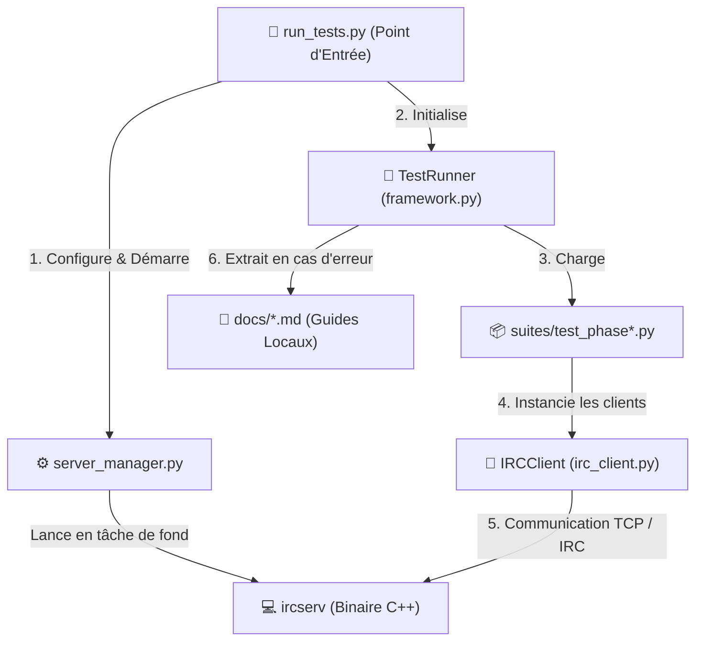

# 🧪 Testeur IRC Modulaire et Diagnostique pour `ft_irc`

Ce répertoire contient un testeur d'intégration robuste, verbeux et interactif pour valider la conformité de votre serveur C++ `ircserv`. Il orchestre automatiquement une suite complète de **27 tests d'intégration** simulant de multiples clients concurrents en conditions réelles.

---

## 🏗️ Architecture du Testeur

Le diagramme ci-dessous illustre comment les différents composants coopèrent pour lancer et tester le serveur IRC :



### Rôle des Composants

*   **`run_tests.py`** : Point d'entrée de la ligne de commande (CLI). Parse les arguments et lance le runner.
*   **`framework.py`** : Gère l'exécution des tests, les assertions, le formatage des logs console (UTF-8 & ANSI), ainsi que l'extraction dynamique des sections de la documentation.
*   **`irc_client.py`** : Client TCP/IRC virtuel. Il enregistre l'historique complet de sa communication (envoyé/reçu) avec horodatage pour faciliter le diagnostic.
*   **`server_manager.py`** : Réserve un port réseau libre de manière dynamique et pilote le cycle de vie du binaire `ircserv`.
*   **`suites/`** : Regroupe les fichiers de tests catégorisés par fonctionnalité (Phase 01 à Phase 12).

---

## 🚀 Utilisation

> [!TIP]
> Assurez-vous d'avoir compilé votre serveur avec `make` à la racine du projet avant de lancer les tests.

Pour exécuter le testeur avec la configuration par défaut (mot de passe `secret`, port automatique) :
```bash
python3 tests/run_tests.py
```

### 🎛️ Arguments de Ligne de Commande

| Option | Rôle | Exemple |
| :--- | :--- | :--- |
| `password` (Optionnel) | Modifie le mot de passe requis par le serveur. | `python3 tests/run_tests.py mon_mot_de_passe` |
| `--verbose` | Configure le niveau de détails (voir tableau ci-dessous). | `python3 tests/run_tests.py --verbose=3` |
| `--binary` | Spécifie un chemin alternatif vers le binaire. | `python3 tests/run_tests.py --binary ./objs/ircserv` |

---

## 📊 Niveaux de Verbosité

| Niveau / Valeur | Style Visuel | Informations Affichées |
| :--- | :--- | :--- |
| **`False` / `0`** <br>*(Défaut)* | **Minimaliste** | Liste à puces montrant uniquement les indicateurs de succès `🟢 [ PASS ]` ou d'échec `🔴 [ FAIL ]` pour chaque test. |
| **`True` / `1`** | **Intermédiaire** | Comprend l'erreur système, le comportement attendu de la RFC, le concept sous-jacent, et le chemin relatif vers le fichier de documentation. |
| **`3`** | **Maximal** | Affiche le suivi d'exécution en direct, les **tracebacks Python complets**, le **journal du trafic réseau envoyé/reçu par chaque client**, et l'**extrait théorique complet** de la documentation locale (`docs/*.md`). |

---

## 📖 Intégration Dynamique de la Documentation

> [!IMPORTANT]
> Chaque cas de test est relié à son guide technique respectif dans le répertoire `docs/`.

Lorsqu'un test échoue en mode `--verbose=True` ou `--verbose=3`, le framework parse les fichiers Markdown de `docs/` en temps réel pour en extraire les chapitres d'explications et d'implémentation C++. L'extrait est affiché directement dans votre terminal pour vous aider à comprendre la cause de l'erreur sans quitter votre éditeur.
